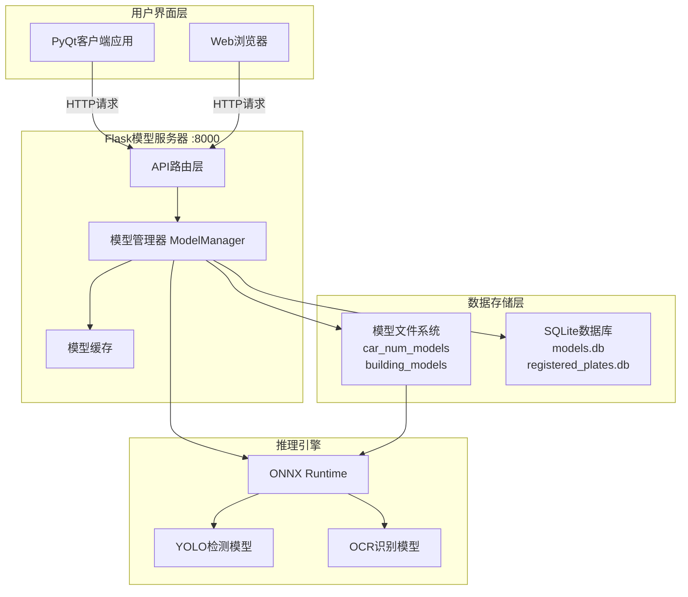
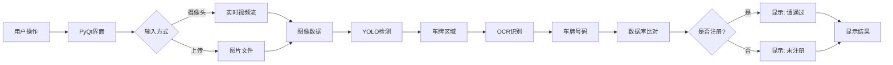
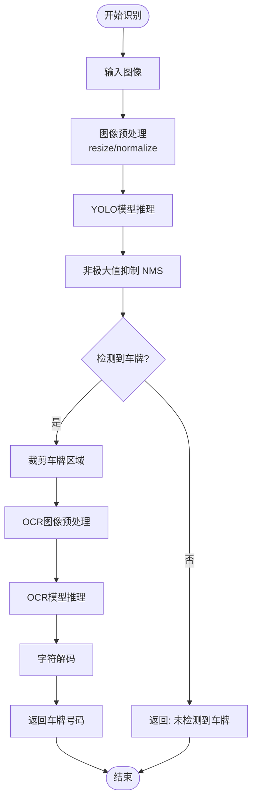
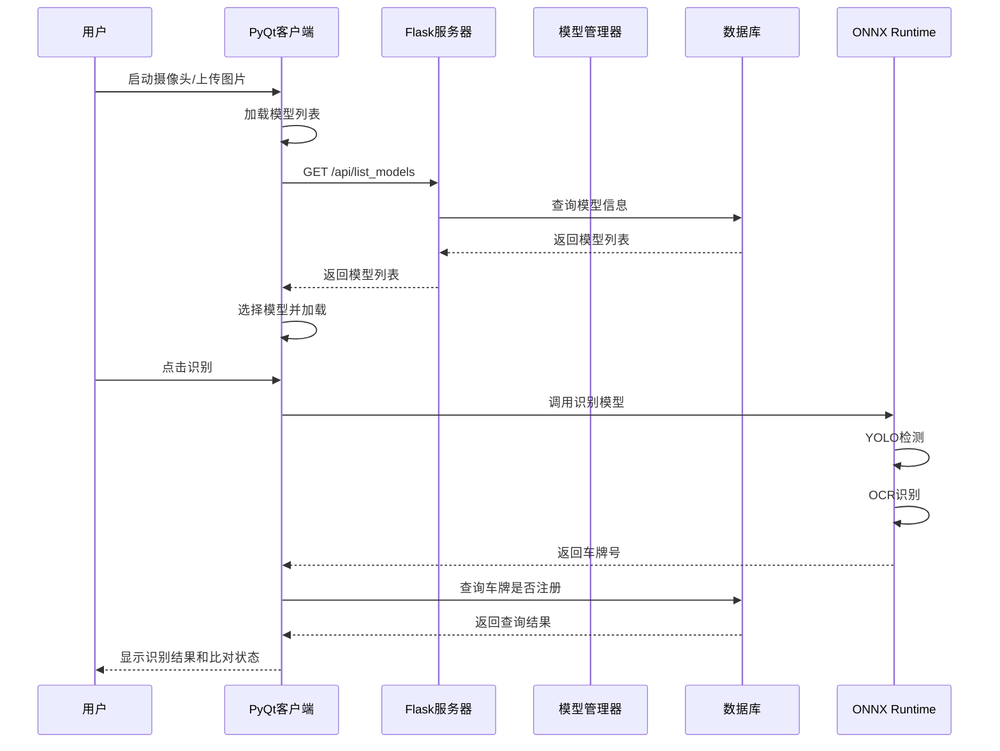

# 车牌识别系统完整课件

## 目录

1. [项目概述](#项目概述)
2. [系统架构](#系统架构)
3. [环境配置](#环境配置)
4. [Flask模型服务器](#flask模型服务器)
5. [PyQt客户端应用](#pyqt客户端应用)
6. [模型管理](#模型管理)
7. [数据库设计](#数据库设计)
8. [核心功能实现](#核心功能实现)
9. [使用教程](#使用教程)
10. [开发指南](#开发指南)
11. [常见问题](#常见问题)

---

## 项目概述

### 1.1 项目简介

本项目是一个完整的车牌识别系统，包含两个主要组件：
- **Flask模型服务器**：提供模型管理和车牌识别API服务
- **PyQt客户端应用**：提供图形界面，支持摄像头识别、图片上传、车牌注册管理等功能

### 1.2 主要功能

#### Flask服务器端
- 模型上传和管理
- 车牌识别API接口
- 建筑物识别API接口
- 模型列表查询
- 支持多种模型类型（车牌识别、建筑物识别、手写识别）

#### PyQt客户端
- 摄像头实时识别（每10帧自动识别）
- 图片上传识别
- 车牌注册管理
- 数据库比对
- 模型选择和管理
- 识别结果显示

### 1.3 技术栈

- **后端框架**：Flask
- **前端框架**：PyQt5
- **深度学习**：ONNX Runtime
- **图像处理**：OpenCV、PIL
- **数据库**：SQLite + SQLAlchemy
- **网络请求**：requests

---

## 系统架构

### 2.1 整体架构图



### 2.2 数据流图



### 2.3 车牌识别流程图



### 2.4 系统组件交互图



---

## 环境配置

### 3.1 Python环境要求

- Python 3.7+
- 推荐使用虚拟环境

### 3.2 依赖安装

#### Flask服务器端依赖

```bash
pip install flask
pip install flask-sqlalchemy
pip install opencv-python
pip install numpy
pip install onnxruntime
pip install Pillow
```

#### PyQt客户端依赖

```bash
pip install PyQt5
pip install opencv-python
pip install numpy
pip install onnxruntime
pip install Pillow
pip install sqlalchemy
pip install requests
```

#### 一键安装（使用requirements文件）

```bash
# Flask服务器
pip install -r requirements.txt

# PyQt客户端
pip install -r requirements_qt.txt
```

### 3.3 项目目录结构

```
car_num_demo/
├── flask_server.py              # Flask服务器主文件
├── car_plate_recognition_app.py  # PyQt客户端主文件
├── onnx_project.py              # 车牌识别核心模块
├── models.py                    # 数据库模型定义
├── requirements.txt             # Flask服务器依赖
├── requirements_qt.txt          # PyQt客户端依赖
│
├── car_num_models/              # 车牌识别模型目录
│   ├── 模型1_时间戳/
│   │   ├── config.json
│   │   ├── yolo_best.onnx
│   │   ├── ocr_best.onnx
│   │   └── ppocr_keys_v1.txt
│   └── 模型2_时间戳/
│       └── ...
│
├── building_models/             # 建筑物识别模型目录
│   └── ...
│
├── templates/                   # Flask HTML模板
│   ├── upload_img.html
│   ├── car_recognition.html
│   ├── building_recognition.html
│   └── upload_model.html
│
├── models.db                    # Flask服务器数据库
└── registered_plates.db         # PyQt客户端数据库
```

---

## Flask模型服务器

### 4.1 服务器概述

Flask模型服务器提供RESTful API接口，支持模型管理和车牌识别功能。

### 4.2 核心文件说明

#### 4.2.1 flask_server.py

**主要功能：**
- Flask应用初始化
- 路由定义
- 模型管理器
- API接口实现

**关键类：**

```python
class ModelManager:
    """模型管理器"""
    def __init__(self):
        self.models = {}  # 缓存已加载的模型
    
    def load_model(self, model_dir):
        """加载模型配置和实例"""
        # 支持多种模型类型
        # - car_yolo_ocr: 车牌识别
        # - building_yolo: 建筑物识别
        # - handwriting_cnn: 手写识别
    
    def list_models(self, model_type=None):
        """列出可用的模型"""
```

### 4.3 API接口详解

#### 4.3.1 获取模型列表

**接口：** `GET /api/list_models`

**参数：**
- `model_type` (可选): 模型类型筛选
  - `car_yolo_ocr`: 车牌识别模型
  - `building_yolo`: 建筑物识别模型
  - `handwriting_cnn`: 手写识别模型

**响应示例：**

```json
{
  "status": "success",
  "models": [
    {
      "model_dir": "car_num_models/模型1_2026-01-23",
      "model_name": "模型1",
      "model_type": "car_yolo_ocr",
      "upload_time": "2026-01-23 10:00:00",
      "model_id": 1
    }
  ]
}
```

**使用示例：**

```python
import requests

response = requests.get('http://localhost:8000/api/list_models?model_type=car_yolo_ocr')
data = response.json()
print(data['models'])
```

#### 4.3.2 车牌识别接口

**接口：** `POST /api/car_recognition`

**请求参数：**
- `model_dir`: 模型目录路径（必填）
- `file`: 图片文件（multipart/form-data）

**响应示例：**

```json
{
  "status": "success",
  "plate_number": "京A12345",
  "confidence": 0.95,
  "detected": true,
  "image": "data:image/jpeg;base64,..."
}
```

**使用示例：**

```python
import requests

files = {'file': open('car_image.jpg', 'rb')}
data = {'model_dir': 'car_num_models/模型1_2026-01-23'}

response = requests.post(
    'http://localhost:8000/api/car_recognition',
    files=files,
    data=data
)
result = response.json()
print(f"识别结果: {result['plate_number']}")
```

#### 4.3.3 上传模型接口

**接口：** `POST /create_model`

**请求参数：**
- `model_type`: 模型类型（必填）
- `model_name`: 模型名称（可选）
- `yolo_file`: YOLO模型文件（车牌识别需要）
- `ocr_file`: OCR模型文件（车牌识别需要）
- `ocr_dict_file`: OCR字典文件（车牌识别需要）
- `conf`: 置信度阈值（可选，默认0.6）
- `iou`: IOU阈值（可选，默认0.5）
- `ocr_shape`: OCR输入形状（可选，默认"3,48,320"）
- `padding`: 是否填充（可选，默认"True"）

**响应示例：**

```json
{
  "status": "success",
  "message": "模型上传成功并已保存到数据库",
  "model_dir": "car_num_models/模型1_2026-01-23",
  "model_id": 1,
  "config": {...}
}
```

### 4.4 模型配置文件格式

**config.json 示例：**

```json
{
  "model_type": "car_yolo_ocr",
  "model_name": "车牌识别模型V1",
  "upload_time": "2026-01-23 10:00:00",
  "yolo_file": "yolo_best.onnx",
  "ocr_file": "ocr_best.onnx",
  "ocr_dict_file": "ppocr_keys_v1.txt",
  "conf": "0.6",
  "iou": "0.5",
  "ocr_shape": "3,48,320",
  "padding": "True"
}
```

### 4.5 启动服务器

```bash
python flask_server.py
```

服务器默认运行在 `http://localhost:8000`

---

## PyQt客户端应用

### 5.1 应用概述

PyQt客户端提供图形界面，支持摄像头识别、图片上传、车牌注册管理等功能。

### 5.2 核心文件说明

#### 5.2.1 car_plate_recognition_app.py

**主要类：**

1. **CameraThread** - 摄像头线程
   ```python
   class CameraThread(QThread):
       frame_ready = pyqtSignal(np.ndarray)  # 每帧显示
       frame_for_recognition = pyqtSignal(np.ndarray)  # 每10帧识别
   ```

2. **CarPlateRecognitionApp** - 主窗口类
   ```python
   class CarPlateRecognitionApp(QMainWindow):
       # 主要功能：
       # - 模型加载和管理
       # - 摄像头控制
       # - 图片上传
       # - 车牌识别
       # - 数据库比对
       # - 车牌注册管理
   ```

3. **RegisteredPlate** - 数据库模型
   ```python
   class RegisteredPlate(Base):
       id = Column(Integer, primary_key=True)
       plate_number = Column(String(50), unique=True)
       owner_name = Column(String(100))
       register_time = Column(DateTime)
       notes = Column(String(500))
   ```

### 5.3 界面布局

```
┌─────────────────────────────────────────────────────────┐
│  模型管理: [下拉框选择模型] [刷新列表]  当前模型: XXX    │
├──────────────────────┬──────────────────────────────────┤
│                      │                                   │
│   图像显示区域        │    车牌注册区域                  │
│   (640x480)          │    - 车牌号输入                  │
│                      │    - 车主姓名输入                │
│                      │    - 备注输入                    │
│                      │    - [注册车牌] [删除选中]      │
│                      │                                   │
│   [启动摄像头]       │    已注册车牌列表                │
│   [上传图片]         │    ┌──────────────────────┐     │
│   [识别车牌]         │    │ ID │ 车牌号 │ 车主 │ 时间 │ │
│                      │    ├──────────────────────┤     │
│   识别结果: XXX      │    │  1 │ 京A123│ 张三 │ ... │ │
│   状态: XXX          │    │  2 │ 京B456│ 李四 │ ... │ │
│                      │    └──────────────────────┘     │
└──────────────────────┴──────────────────────────────────┘
```

### 5.4 核心功能实现

#### 5.4.1 模型加载

```python
def load_model(self, model_dir=None):
    """加载车牌识别模型"""
    # 1. 读取配置文件
    config_path = os.path.join(model_dir, 'config.json')
    with open(config_path, 'r') as f:
        config = json.load(f)
    
    # 2. 构建模型路径
    yolo_path = os.path.join(model_dir, config['yolo_file'])
    ocr_path = os.path.join(model_dir, config['ocr_file'])
    ocr_dict_path = os.path.join(model_dir, config['ocr_dict_file'])
    
    # 3. 创建识别模型
    self.recognition_model = car_num(
        yolo=yolo_path,
        ocr=ocr_path,
        conf=float(config['conf']),
        iou=float(config['iou']),
        ocr_shape=tuple(map(int, config['ocr_shape'].split(','))),
        ocr_dict_path=ocr_dict_path,
        padding=config['padding'].lower() == 'true'
    )
```

#### 5.4.2 摄像头自动识别

```python
def run(self):
    """摄像头线程运行"""
    while self.running:
        ret, frame = self.camera.read()
        if ret:
            # 每帧都发送用于显示
            self.frame_ready.emit(frame)
            
            # 每10帧发送一次用于识别
            self.frame_count += 1
            if self.frame_count >= self.recognition_interval:
                self.frame_for_recognition.emit(frame)
                self.frame_count = 0
```

#### 5.4.3 车牌识别流程

```python
def recognize_plate(self):
    """识别车牌"""
    # 1. 检查图像和模型
    if self.current_image is None or self.recognition_model is None:
        return
    
    # 2. 调用识别模型
    result = self.recognition_model.get(self.current_image)
    
    # 3. 处理识别结果
    plate_number = extract_plate_number(result)
    
    # 4. 比对数据库
    self.check_plate_in_database(plate_number)
```

#### 5.4.4 数据库比对

```python
def check_plate_in_database(self, plate_number, silent=False):
    """检查车牌是否在数据库中"""
    # 1. 查询数据库
    registered_plate = self.db_session.query(RegisteredPlate).filter_by(
        plate_number=plate_number
    ).first()
    
    # 2. 更新界面显示
    if registered_plate:
        # 已注册 - 显示通过
        self.status_label.setText('状态: ✓ 车牌号请通过')
    else:
        # 未注册 - 显示警告
        self.status_label.setText('状态: ✗ 车牌未注册')
```

### 5.5 启动应用

```bash
python car_plate_recognition_app.py
```

---

## 模型管理

### 6.1 模型类型

系统支持三种模型类型：

1. **car_yolo_ocr** - 车牌识别
   - YOLO检测模型（检测车牌位置）
   - OCR识别模型（识别车牌文字）
   - OCR字典文件（字符映射表）

2. **building_yolo** - 建筑物识别
   - YOLO检测模型

3. **handwriting_cnn** - 手写识别
   - CNN分类模型

### 6.2 模型文件结构

```
模型目录/
├── config.json          # 模型配置文件（必需）
├── yolo_best.onnx      # YOLO检测模型
├── ocr_best.onnx       # OCR识别模型
└── ppocr_keys_v1.txt   # OCR字典文件
```

### 6.3 模型上传流程

1. 准备模型文件
2. 访问 `/get_model_html` 页面
3. 填写模型信息
4. 上传模型文件
5. 系统自动保存到对应目录
6. 生成配置文件
7. 保存到数据库

### 6.4 模型选择

**PyQt客户端：**
- 从下拉框选择模型
- 自动从本地和服务器加载模型列表
- 切换模型时自动重新加载

**Flask服务器：**
- 通过 `model_dir` 参数指定模型
- 支持模型缓存，提高性能

---

## 数据库设计

### 7.1 Flask服务器数据库 (models.db)

#### 7.1.1 model_info 表

```sql
CREATE TABLE model_info (
    id INTEGER PRIMARY KEY AUTOINCREMENT,
    model_type VARCHAR(50) NOT NULL,
    model_name VARCHAR(255),
    model_dir VARCHAR(500) NOT NULL,
    upload_time DATETIME NOT NULL,
    config_json TEXT,
    -- 车牌识别模型字段
    yolo_path VARCHAR(500),
    ocr_path VARCHAR(500),
    ocr_dict_path VARCHAR(500),
    conf VARCHAR(50),
    iou VARCHAR(50),
    ocr_shape VARCHAR(100),
    padding VARCHAR(50),
    -- 建筑物识别模型字段
    building_yolo_path VARCHAR(500),
    building_conf VARCHAR(50),
    building_iou VARCHAR(50),
    -- 手写识别模型字段
    cnn_path VARCHAR(500),
    input_shape VARCHAR(100),
    num_classes VARCHAR(50)
);
```

### 7.2 PyQt客户端数据库 (registered_plates.db)

#### 7.2.1 registered_plates 表

```sql
CREATE TABLE registered_plates (
    id INTEGER PRIMARY KEY AUTOINCREMENT,
    plate_number VARCHAR(50) UNIQUE NOT NULL,
    owner_name VARCHAR(100),
    register_time DATETIME DEFAULT CURRENT_TIMESTAMP,
    notes VARCHAR(500)
);
```

### 7.3 数据库操作示例

#### 7.3.1 注册车牌

```python
new_plate = RegisteredPlate(
    plate_number="京A12345",
    owner_name="张三",
    notes="VIP客户",
    register_time=datetime.now()
)
db_session.add(new_plate)
db_session.commit()
```

#### 7.3.2 查询车牌

```python
plate = db_session.query(RegisteredPlate).filter_by(
    plate_number="京A12345"
).first()

if plate:
    print(f"车主: {plate.owner_name}")
```

#### 7.3.3 删除车牌

```python
plate = db_session.query(RegisteredPlate).filter_by(
    plate_number="京A12345"
).first()
if plate:
    db_session.delete(plate)
    db_session.commit()
```

---

## 核心功能实现

### 8.1 车牌识别核心模块 (onnx_project.py)

#### 8.1.1 YOLO检测类

```python
class Yolo:
    def __init__(self, yolo_path, confidence_thres=0.35, iou_thres=0.5):
        # 初始化ONNX Runtime会话
        self.__detect_session = ort.InferenceSession(yolo_path)
    
    def detect_object(self, image):
        # 1. 预处理图像
        img_data = self.__preprocess(image)
        
        # 2. 模型推理
        outputs = self.__detect_session.run(None, {input_name: img_data})
        
        # 3. 后处理（NMS）
        detections = self.__postprocess(outputs)
        
        return detections
```

#### 8.1.2 OCR识别类

```python
class Ocr:
    def __init__(self, ocr_path, ocr_shape, ocr_dict_path, padding=True):
        # 初始化OCR模型和字典
        self.__ocr_session = ort.InferenceSession(ocr_path)
        self.__postprocess_op = self.__process_pred(ocr_dict_path)
    
    def get_ocr(self, img):
        # 1. 图像预处理
        image = self.resize_norm_img(img)
        
        # 2. 模型推理
        outputs = self.__ocr_session.run([output_name], {input_name: image})
        
        # 3. 后处理（解码）
        result = self.__postprocess_op(outputs[0])
        
        return result
```

#### 8.1.3 车牌识别封装类

```python
class car_num:
    def __init__(self, yolo, ocr, conf, iou, ocr_shape, ocr_dict_path, padding):
        # 保存配置，延迟加载模型
        self.yolo = yolo
        self.ocr = ocr
        # ...
    
    def get(self, img):
        # 1. YOLO检测车牌位置
        yolo_model = Yolo(self.yolo, self.conf, self.iou)
        yolo_res = yolo_model.detect_object(img)
        
        # 2. 裁剪车牌区域
        box = yolo_res[0][0]
        car_num_img = img[y1:y2, x1:x2]
        
        # 3. OCR识别车牌文字
        ocr_model = Ocr(self.ocr, self.ocr_shape, self.ocr_dict_path, self.padding)
        ocr_res = ocr_model.get_ocr(car_num_img)
        
        return ocr_res
```

### 8.2 图像处理流程

```
原始图像
    ↓
[YOLO检测]
    ↓
检测框坐标 (x, y, w, h)
    ↓
[图像裁剪]
    ↓
车牌区域图像
    ↓
[OCR识别]
    ↓
车牌文字结果
```

### 8.3 中文文字绘制

```python
def draw_chinese_text(img, text, position, font_size=20, color=(0, 255, 0)):
    """在图片上绘制中文文字（解决OpenCV中文乱码问题）"""
    # 1. 转换为PIL图像
    img_pil = Image.fromarray(cv2.cvtColor(img, cv2.COLOR_BGR2RGB))
    draw = ImageDraw.Draw(img_pil)
    
    # 2. 加载中文字体
    font = ImageFont.truetype('C:/Windows/Fonts/simhei.ttf', font_size)
    
    # 3. 绘制文字
    draw.text(position, text, font=font, fill=color)
    
    # 4. 转换回OpenCV格式
    img_cv = cv2.cvtColor(np.array(img_pil), cv2.COLOR_RGB2BGR)
    return img_cv
```

---

## 使用教程

### 9.1 Flask服务器使用

#### 9.1.1 启动服务器

```bash
cd car_num_demo
python flask_server.py
```

服务器启动后访问：
- 主页：http://localhost:8000
- 车牌识别页面：http://localhost:8000/car_recognition
- 模型上传页面：http://localhost:8000/get_model_html

#### 9.1.2 上传模型

1. 访问模型上传页面
2. 选择模型类型（车牌识别）
3. 填写模型名称
4. 上传YOLO模型文件
5. 上传OCR模型文件
6. 上传OCR字典文件
7. 设置参数（置信度、IOU等）
8. 点击上传

#### 9.1.3 使用API识别

```python
import requests

# 1. 获取模型列表
response = requests.get('http://localhost:8000/api/list_models?model_type=car_yolo_ocr')
models = response.json()['models']
model_dir = models[0]['model_dir']

# 2. 识别车牌
files = {'file': open('car.jpg', 'rb')}
data = {'model_dir': model_dir}
response = requests.post('http://localhost:8000/api/car_recognition', files=files, data=data)
result = response.json()

print(f"车牌号: {result['plate_number']}")
print(f"置信度: {result['confidence']}")
```

### 9.2 PyQt客户端使用

#### 9.2.1 启动应用

```bash
python car_plate_recognition_app.py
```

#### 9.2.2 选择模型

1. 在顶部"模型管理"区域
2. 从下拉框选择要使用的模型
3. 系统自动加载模型
4. 当前模型显示在状态标签中

#### 9.2.3 摄像头识别

1. 点击"📷 启动摄像头"按钮
2. 摄像头画面实时显示
3. 系统每10帧自动识别一次
4. 识别结果自动显示在界面上
5. 点击"⏹ 停止摄像头"停止

#### 9.2.4 图片上传识别

1. 点击"📁 上传图片"按钮
2. 选择包含车牌的图片
3. 图片显示在界面上
4. 点击"🔍 识别车牌"按钮
5. 识别结果和比对结果显示

#### 9.2.5 车牌注册

1. 在右侧"车牌注册"区域
2. 输入车牌号（必填）
3. 输入车主姓名（可选）
4. 输入备注（可选）
5. 点击"✅ 注册车牌"按钮
6. 注册成功后在列表中显示

#### 9.2.6 车牌比对

- **自动比对**：摄像头识别时自动比对，静默显示结果
- **手动比对**：点击"识别车牌"时比对，显示弹窗提示

---

## 开发指南

### 10.1 添加新功能

#### 10.1.1 添加新的模型类型

1. 在 `ModelManager.load_model()` 中添加新类型处理
2. 在 `create_model()` 路由中添加文件处理逻辑
3. 在数据库模型中添加对应字段
4. 更新前端上传页面

#### 10.1.2 添加新的API接口

```python
@app.route('/api/new_feature', methods=['POST'])
def new_feature():
    try:
        # 处理请求
        data = request.json
        # 执行业务逻辑
        result = process_data(data)
        # 返回结果
        return jsonify({'status': 'success', 'result': result})
    except Exception as e:
        return jsonify({'status': 'error', 'message': str(e)}), 500
```

#### 10.1.3 扩展PyQt界面

```python
# 在 init_ui() 中添加新控件
new_button = QPushButton('新功能')
new_button.clicked.connect(self.new_feature_handler)
layout.addWidget(new_button)

# 实现处理函数
def new_feature_handler(self):
    # 实现新功能逻辑
    pass
```

### 10.2 性能优化

#### 10.2.1 模型缓存

```python
# Flask服务器中已实现模型缓存
if model_key in self.models:
    return self.models[model_key]  # 直接返回缓存的模型
```

#### 10.2.2 异步处理

```python
# 使用线程处理耗时操作
from threading import Thread

def async_recognize(image):
    thread = Thread(target=recognize_plate, args=(image,))
    thread.start()
```

#### 10.2.3 图像预处理优化

```python
# 调整图像大小，减少计算量
def preprocess_image(image, max_size=1280):
    h, w = image.shape[:2]
    if max(h, w) > max_size:
        scale = max_size / max(h, w)
        new_w, new_h = int(w * scale), int(h * scale)
        image = cv2.resize(image, (new_w, new_h))
    return image
```

### 10.3 错误处理

#### 10.3.1 异常捕获

```python
try:
    result = model.get(image)
except Exception as e:
    logger.error(f"识别失败: {e}")
    return {'status': 'error', 'message': str(e)}
```

#### 10.3.2 输入验证

```python
def validate_input(data):
    if 'model_dir' not in data:
        return False, "缺少model_dir参数"
    if not os.path.exists(data['model_dir']):
        return False, "模型目录不存在"
    return True, None
```

### 10.4 日志记录

```python
import logging

logging.basicConfig(
    level=logging.INFO,
    format='%(asctime)s - %(name)s - %(levelname)s - %(message)s',
    handlers=[
        logging.FileHandler('app.log'),
        logging.StreamHandler()
    ]
)

logger = logging.getLogger(__name__)
logger.info("应用启动")
```

---

## 常见问题

### 11.1 模型加载失败

**问题：** 提示"模型文件不存在"

**解决方案：**
1. 检查模型文件路径是否正确
2. 确认所有必需文件都存在（yolo、ocr、字典文件）
3. 检查文件权限
4. 验证config.json配置是否正确

### 11.2 摄像头无法打开

**问题：** 点击启动摄像头后提示错误

**解决方案：**
1. 检查摄像头是否被其他程序占用
2. 确认摄像头驱动已正确安装
3. 尝试修改摄像头索引（0改为1或其他）
4. 检查系统权限设置

### 11.3 图片上传失败

**问题：** 上传图片后提示"无法读取"

**解决方案：**
1. 检查图片格式是否支持（JPG、PNG、BMP）
2. 确认图片文件未损坏
3. 检查文件路径是否包含特殊字符
4. 尝试使用其他图片文件

### 11.4 识别准确率低

**问题：** 识别结果不准确

**解决方案：**
1. 确保图片清晰，车牌完整可见
2. 调整模型参数（置信度、IOU阈值）
3. 使用更高质量的模型
4. 检查光照条件

### 11.5 数据库连接错误

**问题：** 提示数据库错误

**解决方案：**
1. 检查数据库文件权限
2. 确认数据库文件未被锁定
3. 检查SQLAlchemy配置
4. 尝试重新创建数据库

### 11.6 服务器连接失败

**问题：** PyQt客户端无法连接Flask服务器

**解决方案：**
1. 确认Flask服务器正在运行
2. 检查服务器地址和端口是否正确
3. 检查防火墙设置
4. 确认网络连接正常

---

## 总结

本系统是一个完整的车牌识别解决方案，包含：

1. **Flask模型服务器**：提供模型管理和识别API
2. **PyQt客户端**：提供友好的图形界面
3. **模型管理**：支持多种模型类型和动态加载
4. **数据库管理**：车牌注册和比对功能
5. **实时识别**：摄像头自动识别功能

系统具有良好的扩展性，可以轻松添加新功能和模型类型。

---

## 附录

### A. 配置文件示例

#### A.1 Flask配置

```python
app.config['SQLALCHEMY_DATABASE_URI'] = 'sqlite:///models.db'
app.config['SQLALCHEMY_TRACK_MODIFICATIONS'] = False
```

#### A.2 PyQt配置

```python
self.server_url = "http://localhost:8000"
self.recognition_interval = 10  # 识别间隔（帧数）
```

### B. API响应码

- `200`: 成功
- `400`: 请求参数错误
- `500`: 服务器内部错误

### C. 参考资源

- Flask官方文档：https://flask.palletsprojects.com/
- PyQt5文档：https://www.riverbankcomputing.com/static/Docs/PyQt5/
- OpenCV文档：https://docs.opencv.org/
- ONNX Runtime文档：https://onnxruntime.ai/

---

**文档版本：** 1.0  
**最后更新：** 2026-01-23  
**作者：** 车牌识别系统开发团队
